# PickNDrop

- PickNDrop is a project intending to create an easy and effective solution for package transportation from one place to another at an affordable price ensuring instant delivery and security. PickNDrop is basically a combination of Courier service+Ola/Uber-like services. It's different from other services, mainly courier because the main motto of project is reducing the expenses required for a common person to deliver a package to faraway cities, which involve either courier charges or traveling charges if the person travels by himself. Along with that, project intends to provide an opportunity for Service Providers to earn extra income via merely delivering a few packages that lie on the same route as their daily routes (Service Providers are transporters or any person who travels on that particular day or on daily basis to the same destination as specified in case of the package and is willing to carry the package along). 
---

## Features
- Authentication with phone number
- Three separate sections for sender, receiver and service provider respectively
- Post, update and delete request to deliver a package 
- Algorithm to map feasible service provider for a specific order
- Google Map integration to implement efficient algorithm
- Razorpay integration for secure payments after successful delivery

## Tech Stack
**Client:** Flutter

**Server:** Firebase

## Future Scope
- Used by: Common people around various districts of maharashtra and nearby states

## Authentication
- Login - Registration Page 

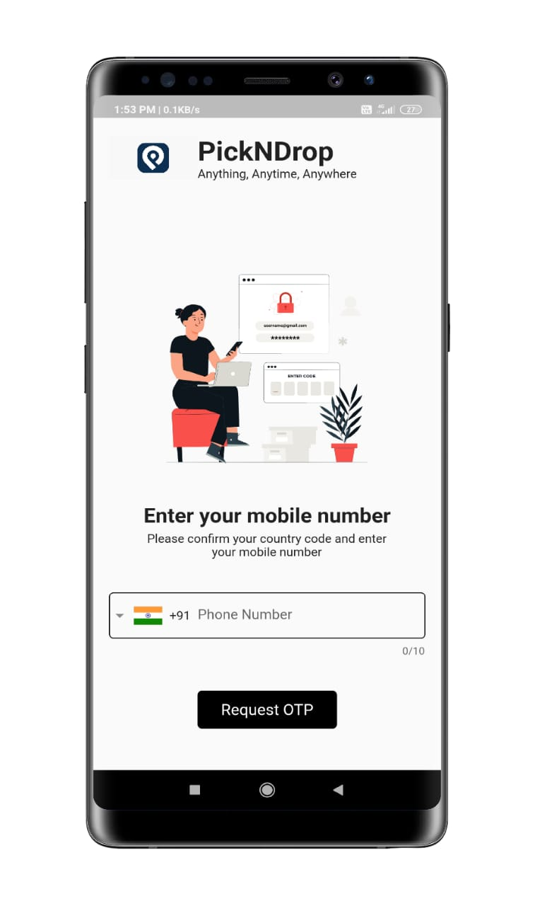
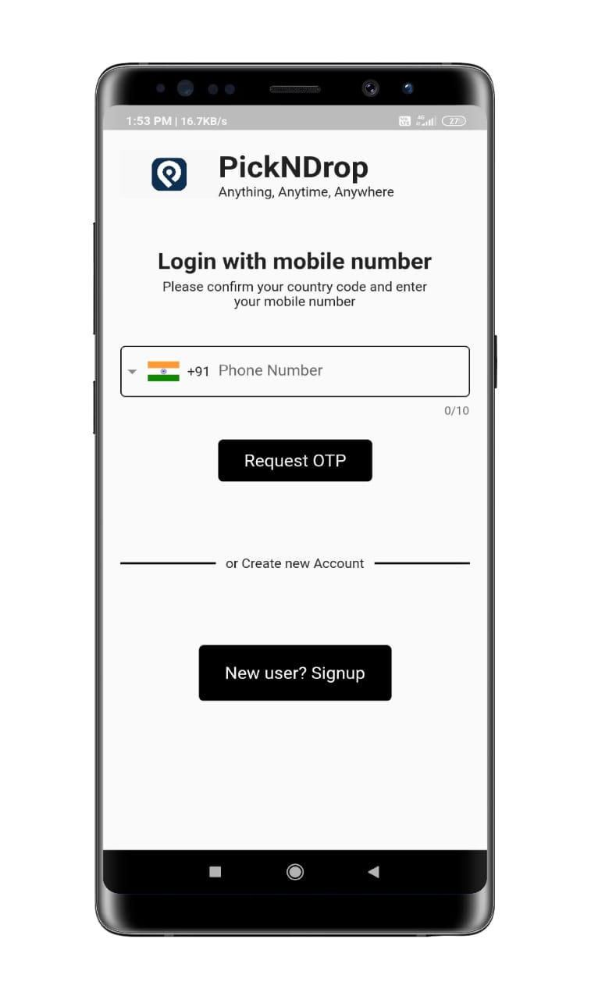

- User Profile Setup

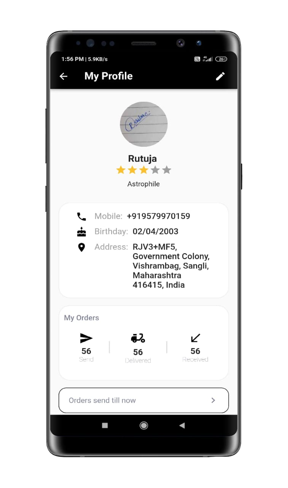

## Home Page 
- Three separate sections for Sender, Receiver and Service Provider respectively

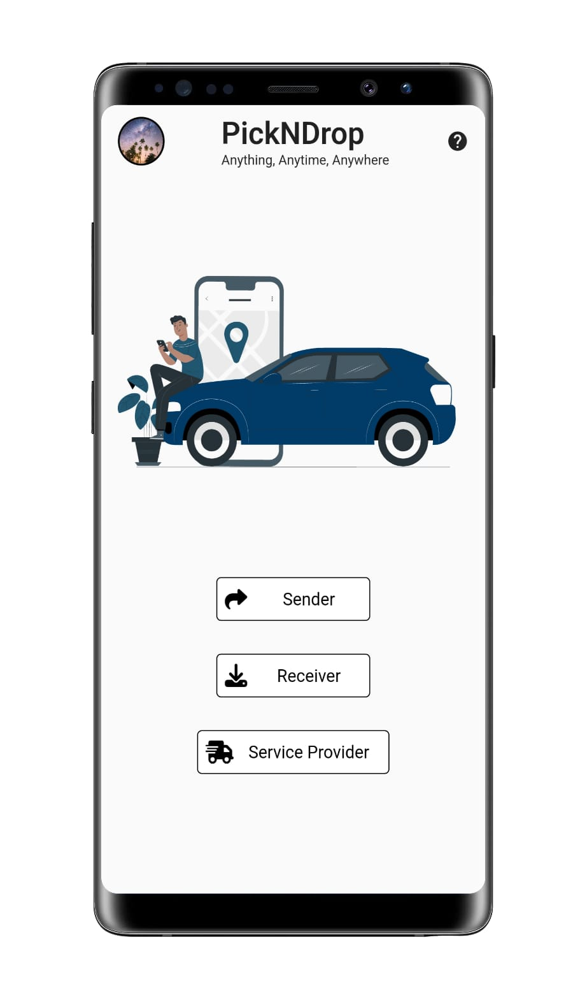

## Sender Section
- Post, update and delete request for package delivery

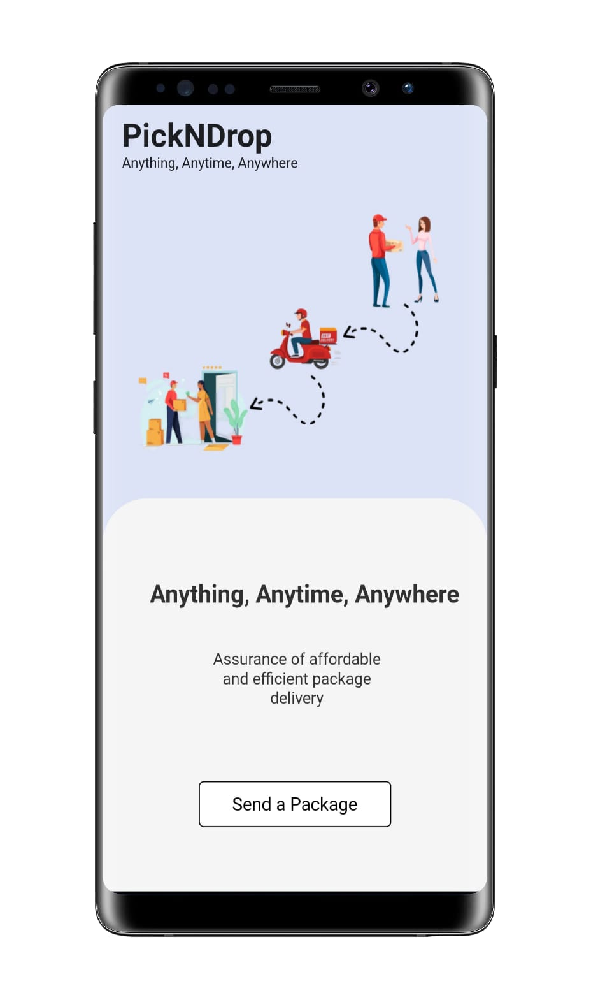

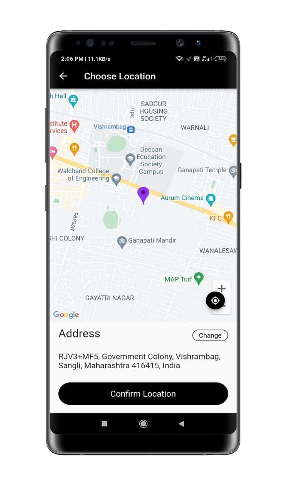
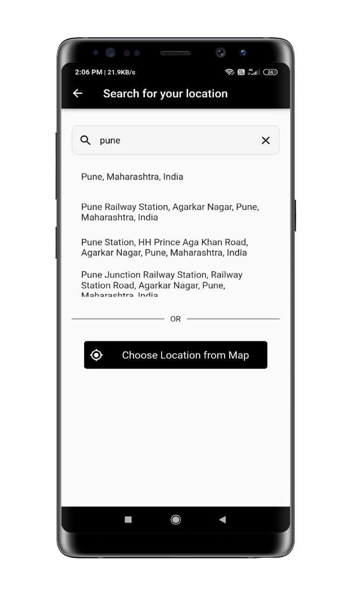

- Select Receiver

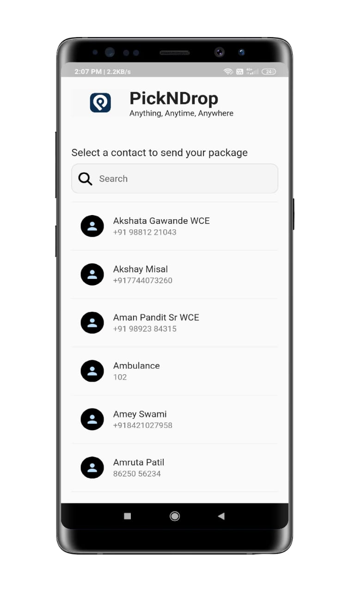

- Payment options after allocation of feasible Service Provider

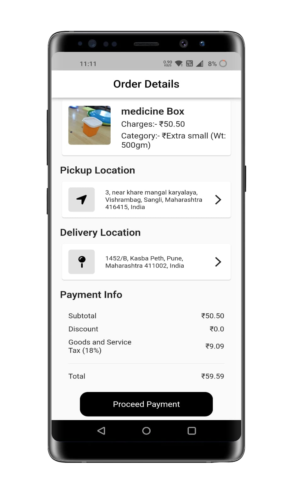
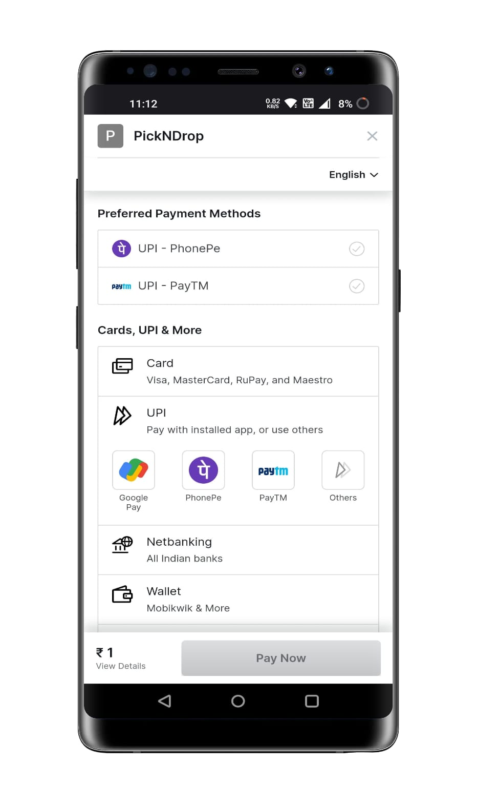

## Service Provider Section
- Plan a trip

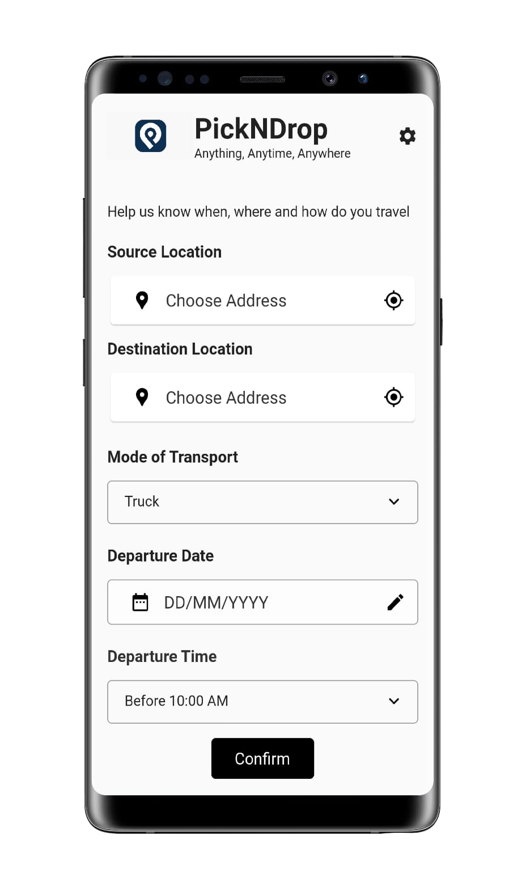

- Checkout details for current order assigned to Service Provider

## Receiver Section
- Checkout Package Details

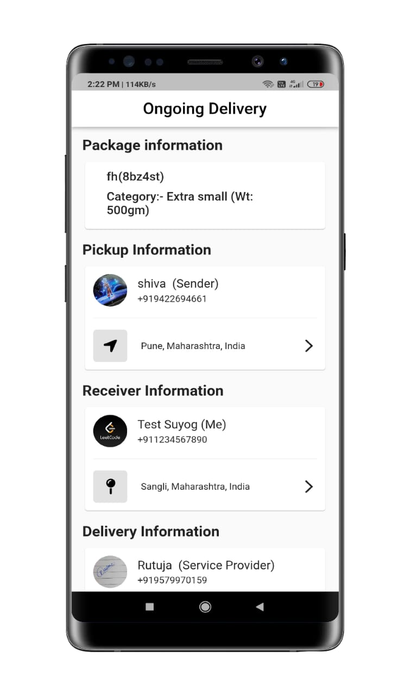

